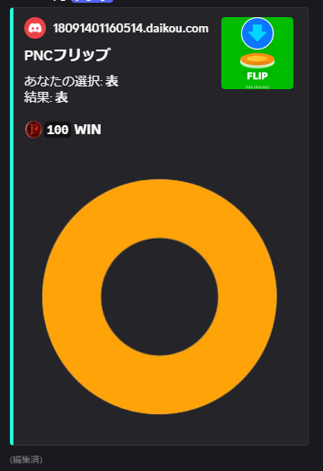
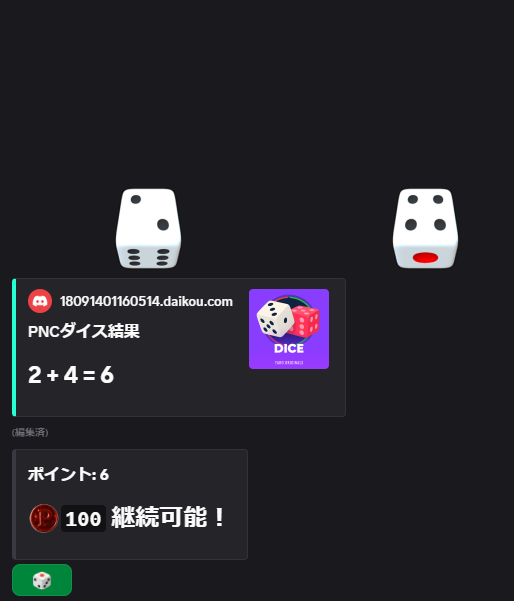
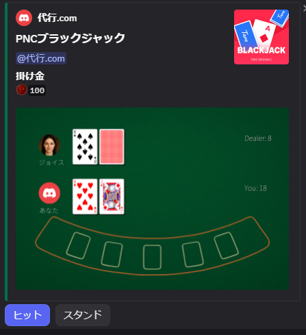
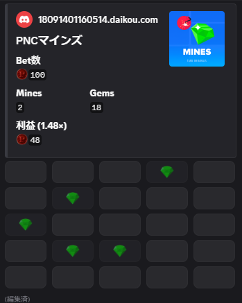
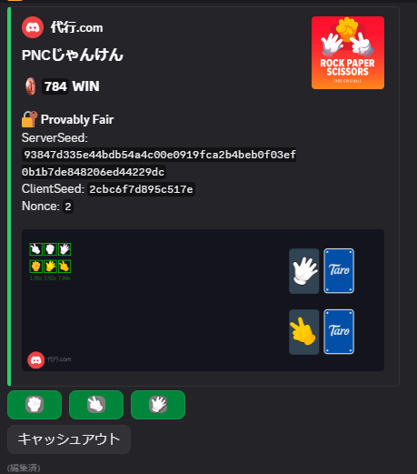

# Discord Casino Bot（実際の金銭取引プログラムなし）
> Discord上で動作する遊び用のカジノゲームボット

## 概要

このプロジェクトは、Discordサーバーで遊べるカジノゲームボットです。**実際の金銭取引は一切発生しません**。仮想通貨 (PNC) を使用した遊び用のゲームボットです。

### 主な機能

- 複数のカジノゲーム（ブラックジャック、ダイス、コインフリップ、マインズ、じゃんけんなど）
- 仮想通貨（PNC）システム
- ユーザー間送金機能
- 景品交換システム
- ランキング機能
- 統計レポート

## ゲーム一覧

### コインフリップ



シンプルな50%の確率ゲーム。コインを投げて表か裏かを当てます。

- **コマンド**: `?フリップ [金額]`
- **最小ベット**: 50 PNC
- **特徴**: 初心者にもわかりやすいシンプルなルール

---

### ダイス（クラップス）



2つのサイコロを振るクラップス風ゲーム。合計値によって勝敗が決まります。

- **コマンド**: `?ダイス [金額]`
- **最小ベット**: 50 PNC
- **ルール**:
  - **勝利**: 合計が7または11の場合、掛け金の2倍を獲得
  - **敗北**: 合計が2、3、12の場合（クラップス）
  - **継続**: それ以外の数値は「ポイント」となり、同じポイントを出せば勝利、7を出せば敗北
- **特徴**: 戦略的な要素を含むダイスゲーム

---

### ブラックジャック



カードゲームの王道、ブラックジャックです。ディーラーと対戦して、21に近づけます。

- **コマンド**: `?bj [金額]`
- **最小ベット**: 100 PNC
- **ルール**:
  - カードの合計が21に近い方が勝利
  - 21を超えるとバスト（敗北）
  - ブラックジャック（初めの2枚で21）で勝利すると高配当
- **特徴**: 
  - Provably Fairシステム実装
  - ヒット、スタンド、ダブルダウンなどの戦略的選択が可能
  - 美しいカード画像で楽しめる

---

### マインズ



マインスイーパー風のリスク管理ゲームです。地雷を避けながらマスを開けていきます。

- **コマンド**: `?マインズ [金額] [地雷数]`
- **最小ベット**: 100 PNC
- **地雷数**: 1〜24個から選択可能
- **ルール**:
  - マスを開けていくたびに報酬が増加
  - 地雷を踏むと即座にゲーム終了（掛け金を失う）
  - いつでもキャッシュアウトして報酬を受け取れる
- **特徴**: 
  - Provably Fairシステム実装
  - リスクとリターンのバランスを考えながら遊ぶ戦略ゲーム
  - 地雷数が多いほど倍率が高くなる

---

### じゃんけん



じゃんけんで対戦するゲームです。連勝するほど倍率が上がっていきます。

- **コマンド**: `?じゃんけん [金額]`
- **最小ベット**: 100 PNC
- **ルール**:
  - ボットとじゃんけんをして勝負
  - 勝つたびに倍率が上がる（最大20連勝まで）
  - 負けると即座にゲーム終了（掛け金を失う）
  - 引き分けの場合は倍率は維持される
  - いつでもキャッシュアウトして報酬を受け取れる
- **特徴**: 
  - Provably Fairシステム実装
  - 連勝が続くほど高額になるハイリスク・ハイリターンなゲーム
  - 美しい画像で進行状況を視覚的に確認できる

## インストール

### 前提条件

- Python 3.10以上
- MongoDB
- Discord Bot Token

### セットアップ手順

1. **リポジトリのクローン**
```bash
git clone https://github.com/rinapen/discord-casino-bot.git
cd discord-casino-bot
```

2. **仮想環境の作成（推奨）**
```bash
python -m venv venv
source venv/bin/activate  # Windows: venv\Scripts\activate
```

3. **依存関係のインストール**
```bash
pip install -r requirements.txt
```

4. **環境変数の設定**

`env.example` をコピーして `.env` ファイルを作成：

```bash
cp env.example .env
```

`.env` ファイルを編集して設定：

```env
# Discord設定
DISCORD_BOT_TOKEN=your_bot_token_here
GUILD_ID=your_guild_id

# チャンネルID設定
ACCOUNT_CHANNEL_ID=your_account_channel_id
INFO_PANEL_CHANNEL_ID=your_info_panel_channel_id
CASINO_LOG_CHANNEL_ID=your_casino_log_channel_id
EXCHANGE_LOG_CHANNEL_ID=your_exchange_log_channel_id
RANKING_CHANNEL_ID=your_ranking_channel_id
ADMIN_CHANNEL_ID=your_admin_channel_id

# MongoDB設定
MONGO_URI=mongodb://localhost:27017/
DB_NAME=casino_bot

# 管理者・除外ユーザーID
ADMIN_USER_ID=your_admin_user_id
EXCLUDED_USER_IDS=123456789,987654321

# 通貨名（デフォルト: PNC）
CURRENCY_NAME=PNC
```

5. **ボットの起動**
```bash
python main.py
```

## 使用方法

### アカウント登録と入金

1. アカウントパネルから「登録」ボタンをクリック
2. 登録完了後、「入金」ボタンから仮想通貨（PNC）を追加
3. モーダルに金額を入力（実際の金銭は発生しません）

### ゲームの遊び方

各ゲームは `?` プレフィックスでコマンドを実行します：

- `?残高` - 現在の残高を確認
- `?フリップ [金額]` - コインフリップゲーム
- `?ダイス [金額]` - ダイスゲーム
- `?bj [金額]` - ブラックジャック
- `?マインズ [金額] [地雷数]` - マインズゲーム
- `?送金 @ユーザー [金額]` - 他のユーザーに送金

### 景品交換システム

PNCを景品に交換できます：

- `?交換` - PNC残高を景品に交換
- `?ポケット` - 景品ポケットの中身を確認
- `?引換` - アカウント交換券を引き換え

## 技術スタック

- **言語**: Python 3.10+
- **フレームワーク**: Discord.py
- **データベース**: MongoDB
- **その他**: 
  - matplotlib (グラフ生成)
  - pytz (タイムゾーン)
  - pymongo (MongoDB接続)

## プロジェクト構造

```
discord-casino-bot/
├── assets/           # ゲーム用アセット（画像、フォント）
├── commands/         # ゲームコマンド実装
├── database/         # データベース接続とモデル
├── tasks/           # 定期タスク（ランキング、レポート）
├── ui/              # DiscordUIコンポーネント
├── utils/           # ユーティリティ関数
├── bot.py           # ボットインスタンス
├── config.py        # 設定ファイル
└── main.py          # エントリーポイント
```

## 開発

### コード品質

- 型ヒント（95%カバレッジ）
- ドキュメント文字列
- セクション分けされた構造
- エラーハンドリング

### 推奨開発ツール

```bash
# 型チェック
mypy .

# コードフォーマット
black .

# リンター
ruff check .
```

## 機能詳細

### Provably Fair システム

一部のゲームでは、Provably Fair（証明可能な公平性）システムを実装しています：

- サーバーシードのハッシュ化
- クライアントシードの使用
- ナンス（nonce）による一意性保証
- HMAC-SHA256による結果生成

## ライセンス

このプロジェクトは自作ライセンスの下で公開されています。詳細は [LICENSE](LICENSE) ファイルを参照してください。

**重要**: このソフトウェアは遊び用であり、実際の金銭取引は一切発生しません。プログラムを改変して利用し、何らかの問題が発生しても、作成者は一切の責任を負いません。

## 免責事項

このソフトウェアは「現状のまま」提供され、明示的または黙示的な保証は一切ありません。使用は完全に自己責任で行ってください。作成者および貢献者は、このソフトウェアの使用、改変、配布によって生じたいかなる損害、法的問題についても一切の責任を負いません。

---

**このボットは遊び用です。実際の金銭取引は発生しません。**
